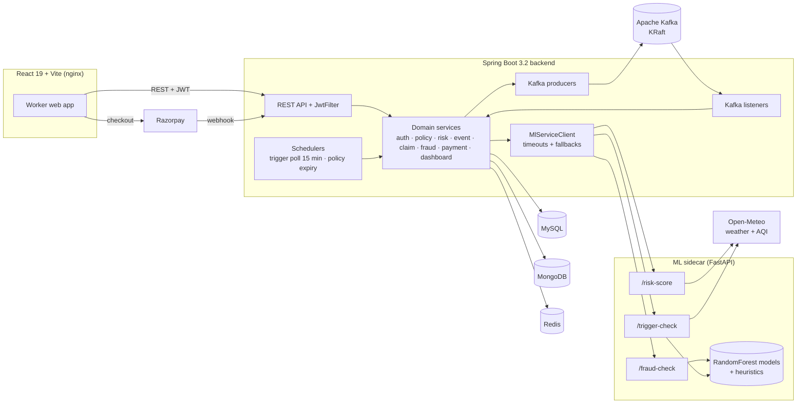
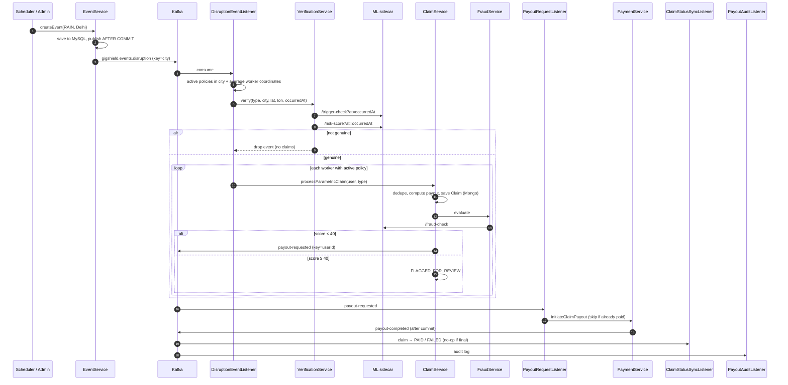
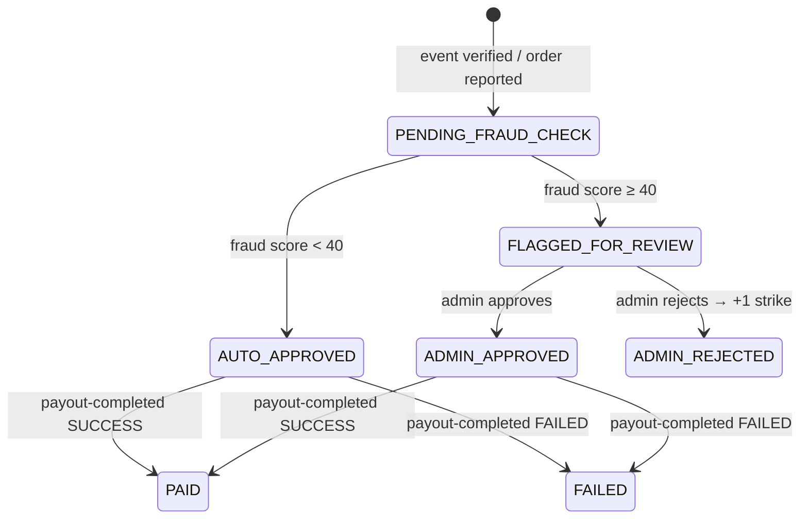
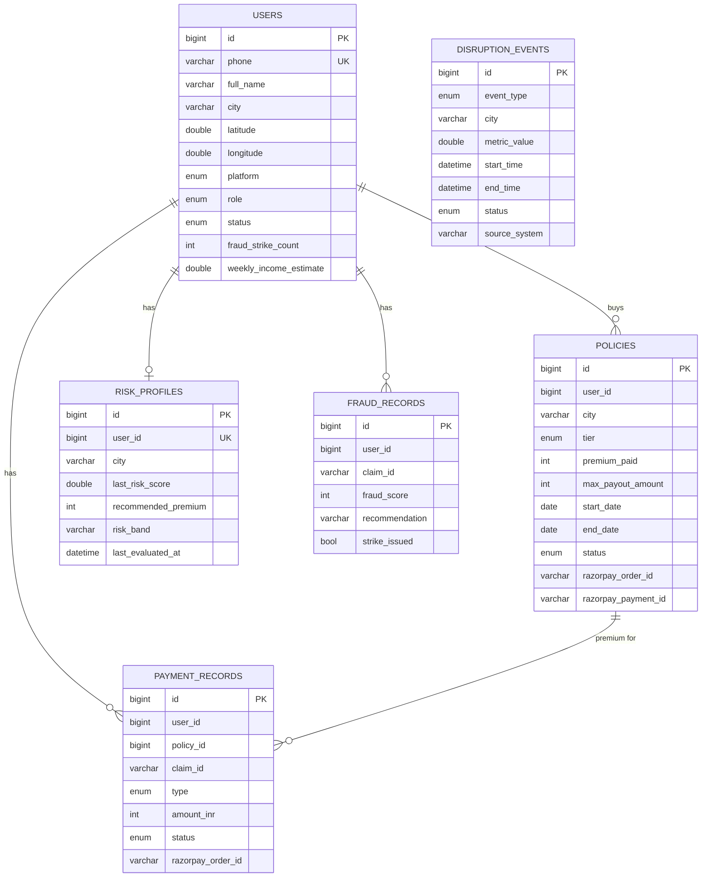
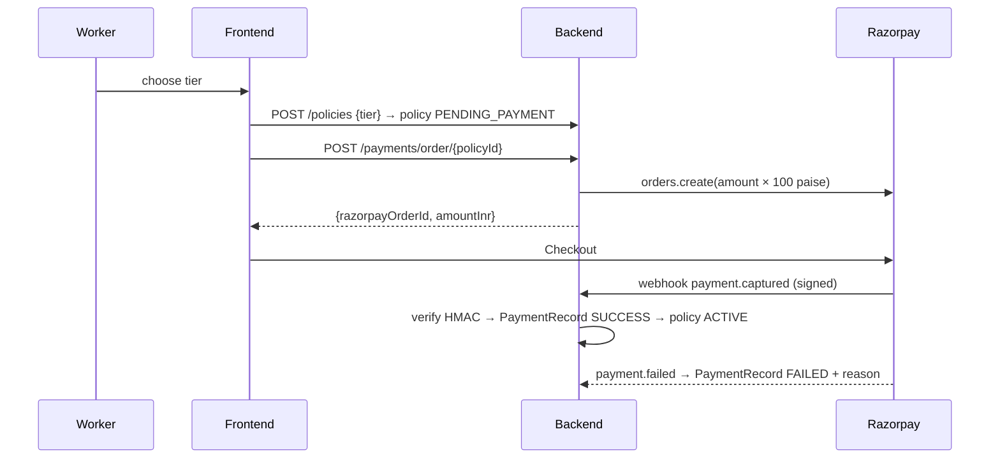

# RiskFlux — Event-Driven Parametric Insurance for Gig Workers

> **RiskFlux** is a parametric micro-insurance platform for food-delivery partners. A worker buys a weekly policy for ₹15–30. When a real disruption (heavy rain, hazardous AQI, curfew, traffic block, unrest, or a cancelled order) hits their area, RiskFlux **checks the event against live and historical weather data with two independent ML checks**, scores the claim for fraud, and **pays out automatically** through a Kafka-driven pipeline, with no claim form and no manual review unless fraud is suspected.

           

**Type:** Hackathon team project. The problem statement (parametric insurance for gig workers) came from the hackathon.
**My contribution:** the **entire backend** (Spring Boot, Kafka pipeline, data model, security, payments), the **ML sidecar** (FastAPI service, three trained models, weather integration, fallbacks), and the **overall system architecture**.
**Naming:** the project was earlier called *GigShield*, so packages (`com.gigshield`), Kafka topics, Docker images and folder names still use `gigshield`.

---

## Table of Contents

1. [The Problem](#1-the-problem)
2. [The Solution](#2-the-solution)
3. [What Makes RiskFlux Different](#3-what-makes-riskflux-different)
4. [Feature List](#4-feature-list)
5. [Architecture](#5-architecture)
6. [Event-Driven Pipeline (Kafka)](#6-event-driven-pipeline-kafka)
7. [The Verification Gate](#7-the-verification-gate)
8. [Claims, Fraud Scoring & the Strike/Ban System](#8-claims-fraud-scoring--the-strikeban-system)
9. [Risk-Based Pricing & Payout Rules](#9-risk-based-pricing--payout-rules)
10. [ML Sidecar](#10-ml-sidecar)
11. [Data Model (Polyglot Persistence)](#11-data-model-polyglot-persistence)
12. [Authentication & Security](#12-authentication--security)
13. [Payments (Razorpay)](#13-payments-razorpay)
14. [Non-Functional Requirements](#14-non-functional-requirements)
15. [API Reference](#15-api-reference)
16. [Frontend](#16-frontend)
17. [Tech Stack & Why](#17-tech-stack--why)
18. [Project Structure](#18-project-structure)
19. [Configuration](#19-configuration)
20. [Running Locally](#20-running-locally)
21. [Testing](#21-testing)
22. [CI/CD & Deployment](#22-cicd--deployment)
23. [Bugs Found & Fixed](#23-bugs-found--fixed)
24. [Design Decisions & Trade-offs](#24-design-decisions--trade-offs)
25. [Known Issues](#25-known-issues)
26. [Roadmap](#26-roadmap)
27. [Project Facts (Quick Reference)](#27-project-facts-quick-reference)

---

## 1. The Problem

India's delivery partners (Zomato/Swiggy-style) earn day to day and work outdoors. Their income drops whenever something they can't control happens:

- heavy rain or flooding
- hazardous air quality
- curfews, lockdowns, unrest
- traffic restrictions
- an order cancelled by the restaurant or platform after they've already committed to it

There's no structured financial protection for any of this. Traditional insurance needs claim forms, proof and manual review, which is far too slow and expensive for a ₹100–500 loss.

## 2. The Solution

**Parametric insurance**: the payout is triggered by a *measurable event* (e.g. rainfall ≥ 35 mm, AQI ≥ 300), not by proving an individual loss.

| Step | What happens |
|---|---|
| 1. Buy | Worker picks a weekly tier (Standard / Gold / Premium). The price is adjusted by the **live ML risk score** of their location. Paid through Razorpay. |
| 2. Detect | A scheduler polls the ML sidecar every 15 min for 6 monitored cities; admins can also raise city-wide events (curfew, traffic, war). |
| 3. Verify | Every event must pass **two independent ML checks**, done **as of the time the event happened**, before any claim is created. |
| 4. Fan out | Kafka fans one city-wide event out into a claim for every worker with an active policy in that city. |
| 5. Score | Each claim gets an ML fraud score: low score → auto-approved, high score → held for admin review. |
| 6. Pay | Approved claims publish a payout request to Kafka → payment service records the payout → completion event updates the claim to `PAID` and writes an audit log. |

---

## 3. What Makes RiskFlux Different

### 3.1 Dual ML verification gate: events aren't trusted at face value
No event (scheduler-detected, admin-created or worker-reported) is turned into claims until **both** checks agree:
1. **Trigger check**: the ML sidecar confirms that specific event type is actually active at that location (rain ≥ 35 mm, AQI ≥ 300, optionally confirmed by a trained disruption classifier).
2. **Risk-score check**: an independent risk score for the same place and time must be ≥ 20/100.

If either fails, the event is logged and dropped: no claims, no fraud checks, no payouts. Faking an event that fools two independent checks over real external data is much harder than gaming one rule.

### 3.2 Point-in-time verification ("as of when it happened")
Claims are checked against the weather **at the moment the event occurred**, not at processing time. Kafka consumer lag or a worker reporting hours later can't flip the verdict. The ML sidecar pulls **hourly historical rainfall and AQI from Open-Meteo** for that date, picks the hour closest to the event timestamp, and caches the result permanently, since past weather never changes.

### 3.3 Event-driven, idempotent payout pipeline
- 3 Kafka topics, 4 consumer groups; one disruption event fans out to hundreds of claims without blocking the API.
- **Events are published only after the database commit** (via `TransactionSynchronization.afterCommit`), so consumers never see an event for data that was rolled back.
- **Idempotent producer** (`acks=all`, `enable.idempotence=true`, 5 retries) + **manual per-record acknowledgement** + **exponential backoff retries → dead-letter topic** (`<topic>.DLT`).
- **Idempotent consumers**: a redelivered payout request never creates a second payment; a redelivered completion never re-processes a `PAID` claim.

### 3.4 Defence-in-depth for cancelled orders
A single cancelled order affects one worker, not a city, so it's **blocked from the automated pipeline at 3 layers** (event creation, Kafka listener, claim service) and goes through a separate worker-reported flow instead: 72-hour reporting window, no future timestamps, duplicate-report check, the same point-in-time verification using that worker's own GPS coordinates, and a low ₹150 cap.

### 3.5 Graceful degradation everywhere
| Failure | Behaviour |
|---|---|
| ML sidecar down → risk score | Neutral fallback (50 / MEDIUM / ₹22), so pricing still works |
| ML sidecar down → fraud check | **Fails safe**: score 50 → claim held for review, never auto-paid |
| ML sidecar down → trigger check | Empty result, so no event is created |
| Open-Meteo unreachable | Deterministic, location-seeded fallback values that **can't cross the trigger thresholds**, so a network outage never causes a payout |
| Models not trained yet | Sidecar serves immediately with rule-based heuristics while training runs in the background, and **switches to trained models without a restart** |
| Kafka consumer error | Retries with exponential backoff (1 s, ×2, max 15 s) → dead-letter topic |

---

## 4. Feature List

### Worker
- Phone + OTP sign-up/login (6-digit OTP, 5-minute expiry, 3 attempts); registration captures name, city, **GPS coordinates** (browser geolocation) and platform (Zomato / Swiggy / Other).
- **Live risk snapshot** for their location (score, band, recommended premium), cached for 1 hour.
- **Three weekly tiers** priced by live risk: Standard (30% of weekly income covered), Gold (35%), Premium (40%).
- Razorpay checkout (or simulated checkout when no key is set).
- Dashboard: active cover, risk band, strikes, total payouts, pending claims; refreshes every 30 s.
- Claims list with status (processing → approved → paid / under review / rejected / failed) and **"happened at / reported at"** times.
- **Report a cancelled order** (time picker capped at "now", optional 280-character note).
- Policy and payout history.

### Automation
- **Trigger scheduler**: polls 6 cities (Delhi, Mumbai, Bengaluru, Chennai, Hyderabad, Kolkata) every 15 min; skips a city/event type that already has an active event.
- **Automatic claim creation** for every active policy in the affected city, once per policy per event type.
- **Automatic fraud scoring** and auto-approve / hold decision.
- **Automatic payout** through Kafka with status sync back to the claim.
- **Policy expiry job** at midnight IST.

### Admin
- Create city-wide disruption events (`RAIN`, `AQI`, `CURFEW`, `TRAFFIC`, `WAR`) and resolve them.
- Review flagged claims: approve (→ payout) or reject (→ fraud strike).
- Admin dashboard: total workers, flagged/approved/rejected claims, premiums collected, payouts issued, **net position**, claims by status.

---

## 5. Architecture

### 5.1 System overview



### 5.2 Three independently deployable services

| Service | Stack | Responsibility |
|---|---|---|
| `gigshield-backend` | Java 17, Spring Boot 3.2.5 | Auth, policies, pricing, events, Kafka pipeline, claims, fraud orchestration, payments, dashboards |
| `gigshield-ml` | Python 3.12, FastAPI, scikit-learn | Risk scoring, trigger detection, fraud scoring, weather/AQI integration |
| `gigshield-frontend` | React 19, Vite, nginx | Worker web app |

### 5.3 Backend modules (package by domain)

```
com.gigshield
├── auth        OTP, JWT, refresh tokens, JwtFilter (with Redis ban check)
├── user        worker profile, coordinates, strikes, ban logic
├── policy      tiers, risk-based pricing, purchase, activation, expiry scheduler
├── risk        risk score (Redis cache → ML sidecar), RiskProfile upsert
├── event       DisruptionEvent, trigger scheduler, Kafka producer
├── claim       Claim (Mongo), verification gate, Kafka listeners, admin review
├── fraud       fraud evaluation via ML, FraudRecord audit, strikes
├── payment     Razorpay orders + webhook, payout producer/listeners
├── dashboard   worker + admin aggregates
├── integration MlServiceClient + external DTOs
├── kafka       topics, producer/consumer config, DLT error handler
└── config      security, CORS, Redis, RestTemplate, Razorpay, exception handler, constants
```

---

## 6. Event-Driven Pipeline (Kafka)

### 6.1 Topics and consumer groups

| Topic | Partitions | Key | Producer | Consumer group → Listener |
|---|---|---|---|---|
| `gigshield.events.disruption` | 3 | city | `DisruptionEventProducer` | `gigshield-claims-automation` → `DisruptionEventListener` |
| `gigshield.payments.payout-requested` | 3 | userId | `PayoutEventProducer` | `gigshield-payments` → `PayoutRequestListener` |
| `gigshield.payments.payout-completed` | 3 | userId | `PayoutEventProducer` | `gigshield-claim-status-sync` → `ClaimStatusSyncListener`<br/>`gigshield-audit` → `PayoutAuditListener` |
| `<topic>.DLT` | — | — | `DeadLetterPublishingRecoverer` | (for inspection) |

Keying by **city** keeps events for one city in order on one partition; keying payouts by **userId** keeps each worker's payouts in order. `payout-completed` is read by **two consumer groups**, so claim-status sync and audit logging each get every event independently.

### 6.2 End-to-end flow



### 6.3 Reliability settings

| Setting | Value | Why |
|---|---|---|
| Producer `acks` | `all` | Write confirmed by all in-sync replicas |
| Producer idempotence | `true`, retries 5 | No duplicates from producer retries |
| Consumer auto-commit | `false`, ack mode `RECORD` | Offset committed only after a record is processed |
| `auto-offset-reset` | `earliest` | New consumer groups don't skip events |
| Deserialization | `ErrorHandlingDeserializer` → `JsonDeserializer` (trusted `com.gigshield.*`) | A bad message can't crash the listener |
| Error handler | `DefaultErrorHandler` with `ExponentialBackOff(1s, ×2, max 15s)` + `DeadLetterPublishingRecoverer` | Retries short failures; parks bad messages in `<topic>.DLT` |
| Publish timing | `afterCommit` hook | No events for rolled-back data |

---

## 7. The Verification Gate

`DisruptionEventVerificationService.verify(eventType, city, lat, lon, occurredAt)` returns a verdict `{genuine, triggerConfirmed, riskConfirmed, reason}`.

| Rule | Detail |
|---|---|
| Trigger confirmed | ML `/trigger-check` returns this event type as active for these coordinates at `occurredAt` |
| Risk confirmed | ML `/risk-score` at the same coordinates and time is **≥ 20.0** |
| Genuine | trigger **AND** risk |
| Missing coordinates | Risk check is skipped, so the event is **not genuine**; a missing check never counts as a pass |
| `WAR` | Bypassed by product rule, since unrest can't be confirmed from weather |
| Coordinates used | City-wide events use the **average of the real registered coordinates** of all affected workers; cancelled orders use **that worker's own coordinates** |

**Time handling in the ML sidecar** (`get_weather_signal_at`):
- Future timestamps (> 5 min ahead) → safe fallback.
- Older than 90 days → safe fallback **without a network call** (outside Open-Meteo's history window).
- Otherwise → Open-Meteo hourly data for that date; nearest hour to the timestamp; cached forever per `(lat, lon, hour)`.

---

## 8. Claims, Fraud Scoring & the Strike/Ban System

### 8.1 Claim lifecycle



### 8.2 Guards on claim creation

| Guard | Automated claims | Cancelled-order claims |
|---|---|---|
| Active policy required | ✔ | ✔ |
| Duplicate check | One claim per (user, policy, event type) | One per (user, policy, `ORDER_CANCELLED`, exact `cancelledAt`) |
| Event still active | `DisruptionEvent` must be `ACTIVE` | — |
| Time window | — | Not > 5 min in future, not > 72 h old |
| Verification gate | ✔ (averaged coordinates) | ✔ (worker's own coordinates, as of `cancelledAt`) |
| Fraud check | ✔ | ✔ |

### 8.3 Fraud scoring
- `FraudService` calls ML `/fraud-check` → score 0–100.
- **< 40 → AUTO_APPROVE**, **≥ 40 → REVIEW**.
- `WAR` claims skip the fraud check (score 0).
- Every evaluation is saved as a `FraudRecord` (score, recommendation, event type, strike issued) for auditing; repeat evaluations for the same claim are blocked.

### 8.4 Strikes and bans
- **Strikes come only from admin rejections**, so a single borderline score never punishes a worker.
- Strike count is incremented with an atomic SQL `UPDATE … SET count = count + 1`.
- **3 strikes → status `BANNED`** in MySQL **and** a Redis key `ban:<phone>` (TTL = JWT lifetime).
- `JwtFilter` checks the Redis key on **every request** → returns `403 Account permanently suspended` immediately, even if the worker still holds a valid JWT. Login is also blocked through `isAccountNonLocked()`.

---

## 9. Risk-Based Pricing & Payout Rules

### 9.1 Premium

```
multiplier = 0.80 + (1.35 − 0.80) × (riskScore / 100)      // riskScore clamped to 0–100
premium    = round(basePremium(tier) × multiplier)
```

| Tier | Base premium | Coverage (% of weekly income) |
|---|---|---|
| Standard | ₹15 | 30% |
| Gold | ₹22 | 35% |
| Premium | ₹30 | 40% |

So a zero-risk area pays 80% of base and a maximum-risk area pays 135%. ML-recommended premium after the pricing fix: mild → risk 10.7 / ₹17 / LOW; heavy rain → 70.9 / ₹26 / HIGH; high AQI → 41.7 / ₹21 / MEDIUM; both severe → 95.3 / ₹29 / HIGH.

### 9.2 Payout

| Event | Payout |
|---|---|
| `RAIN`, `AQI`, `CURFEW` | Policy max payout = weekly income × tier ratio (default income ₹3,500) |
| `TRAFFIC` | min(max payout, **₹200**) |
| `WAR` | min(max payout, **₹500**) |
| `ORDER_CANCELLED` | min(max payout, **₹150**) |

Policies run **7 days**; only one active policy per worker per week; stale policies are expired by a midnight IST cron job.

---

## 10. ML Sidecar

### 10.1 Endpoints

| Method | Path | Input | Output |
|---|---|---|---|
| GET | `/health` | — | `{status: UP}` |
| GET | `/risk-score` | `city, latitude, longitude, platform?, at?` | `{riskScore 0–100, recommendedPremium ₹15–30, riskBand LOW/MEDIUM/HIGH}` |
| GET | `/trigger-check` | `city, latitude?, longitude?, at?` | `{city, activeTriggers[], metricValues{}}` |
| POST | `/fraud-check` | `{userId, city, latitude, longitude, eventType, policyId}` | `{fraudScore 0–100, recommendation}` |

Field names match the Java DTOs exactly, so no mapping layer is needed.

### 10.2 Models

| Model | Algorithm | Training data | Features | Used for |
|---|---|---|---|---|
| **Risk model** | RandomForestRegressor (200 trees, depth 14) | IMD subdivision rainfall (`weather.csv`, monthly, 1901+) joined with CPCB station AQI (`aqi.csv`, ~435k rows); weighted label 0.5·rain + 0.3·AQI + 0.2·historical disruptions | rainfall, AQI, temperature, humidity, historical disruptions | Trained and evaluated (R², MSE); **serving uses a calibrated heuristic** (see §23, bug 2) |
| **Fraud model** | RandomForestClassifier (200 trees, `class_weight=balanced`) | 5,000 synthetic rows, probabilistic labels, balanced to ~30% fraud; default (0.5) vs tuned (0.35) threshold compared | gps_distance, account_age, device_count, zone_change, claims_count, purchase_before_event | `/fraud-check` via `predict_proba × 100` (a graded score, not a yes/no) |
| **Disruption predictor** | RandomForestClassifier (200 trees, depth 14, balanced) + MinMaxScaler | Same merged weather + AQI dataset, probabilistic labels (0.35 rain, 0.30 AQI, 0.20 history, 0.10 temp, 0.05 humidity) | rainfall, AQI, temperature, humidity, historical disruptions | Confirms threshold-based RAIN/AQI triggers; it can only **demote** a trigger, never invent one |

### 10.3 Serving logic
- **Risk score** (heuristic, calibrated to hourly readings): `100 × (0.625 × min(1, rain/60mm) + 0.375 × min(1, AQI/400))`; bands LOW < 35 ≤ MEDIUM < 65 ≤ HIGH.
- **Triggers**: `RAIN` if rainfall ≥ **35 mm**, `AQI` if AQI ≥ **300**, then confirmed by the disruption predictor when it's available. `CURFEW`/`TRAFFIC`/`WAR` are never auto-detected; they stay admin-created.
- **Fraud**: `gps_distance` = haversine distance from the worker's coordinates to the claimed city's centre (a real signal); the other five features use neutral defaults until the backend sends account history. Heuristic fallback: > 30 km → 55, > 10 km → 25, else 10.
- **Weather**: Open-Meteo forecast + air-quality APIs (free, no key), 4 s timeout, live readings cached 5 min per ~1 km grid cell, historical readings cached permanently.
- **Model loading**: `entrypoint.sh` starts serving immediately and trains in the background (`train_all.py`, skips existing models, `--force` to retrain). Each inference module re-checks disk until its model appears, then caches it, so models are picked up **without a restart**. `SKIP_TRAINING=true` disables training.

---

## 11. Data Model (Polyglot Persistence)

| Store | What lives there | Why |
|---|---|---|
| **MySQL** (JPA) | `users`, `policies`, `risk_profiles`, `disruption_events`, `payment_records`, `fraud_records`, `otp_records`, `refresh_tokens` | Relational, transactional data: money, policies, identities, unique constraints |
| **MongoDB** | `claims` (indexed on `userId`, `policyId`, `status`) | High-volume, append-heavy documents whose fields vary by event type |
| **Redis** | `risk:score:<phone>` (1 h TTL), `ban:<phone>` (24 h TTL) | Fast cache + instant ban enforcement on every request |



**Mongo `claims` document:** `id, userId, policyId, triggerEvent, city, payoutAmount, fraudScore, status, adminNote, razorpayPayoutId, eventOccurredAt, createdAt, processedAt, updatedAt`.

**Indexes (MySQL):** `idx_user_phone`, `idx_user_city`, `idx_policy_user`, `idx_policy_active (status, endDate)`, `idx_risk_user` (unique), `idx_event_city_type (city, eventType)`, `idx_event_active (status, startTime)`, `idx_payment_user/policy/claim`, `idx_fraud_user`, `idx_otp_phone`.

**Enums:** `EventType {RAIN, AQI, CURFEW, TRAFFIC, WAR, ORDER_CANCELLED}` · `ClaimStatus {PENDING_FRAUD_CHECK, AUTO_APPROVED, FLAGGED_FOR_REVIEW, ADMIN_APPROVED, ADMIN_REJECTED, PAID, FAILED}` · `PolicyStatus {PENDING_PAYMENT, ACTIVE, EXPIRED, CANCELLED}` · `EventStatus {ACTIVE, RESOLVED, EXPIRED}` · `UserStatus {ACTIVE, SUSPENDED, BANNED}` · `PaymentType {PREMIUM_COLLECTION, CLAIM_PAYOUT}`.

---

## 12. Authentication & Security

| Control | Implementation |
|---|---|
| Passwordless login | Phone + 6-digit OTP from `SecureRandom`; 5-min expiry; max 3 attempts; earlier OTPs invalidated on resend; SMS mocked in dev |
| Registration | Inferred from extra fields on `verify-otp` (name, city, lat/lon, platform); required fields validated for new users |
| Access token | JWT HS256, 24 h, `role` claim, `Authorization: Bearer` header |
| Refresh token | Random UUID in MySQL, 7 days, revoked on logout |
| Stateless | `SessionCreationPolicy.STATELESS`, CSRF off (no cookies) |
| Ban enforcement | Redis `ban:<phone>` checked in `JwtFilter` before auth → 403 |
| Role-based access | `ROLE_WORKER` / `ROLE_ADMIN`; URL rules + `@PreAuthorize` on admin endpoints (events, flagged claims, review, admin dashboard) |
| Input validation | Bean Validation (Indian mobile regex `^[6-9]\d{9}$`, 6-digit OTP, `@Positive` income, 280-char note) |
| Webhook security | Razorpay **HMAC signature verification** on `/payments/webhook` |
| Error handling | `GlobalExceptionHandler`: 400 validation (field → message map), 400 bad argument, 409 conflict, 401, 403, 500 with no stack trace leakage |
| Secrets | Env vars / gitignored `application-secrets.yml`; `.env.example` template |

**Frontend session handling:** axios interceptor attaches the token, refreshes on 401 with a **single shared refresh promise** (so many parallel 401s cause one refresh), retries the original request, and ends the session on refresh failure or a 403 ban.

---

## 13. Payments (Razorpay)



- Premium collection: **real Razorpay Orders API** (test mode) + signed webhook activation.
- Claim payouts: recorded as `CLAIM_PAYOUT` payment records; the real Razorpay Payouts API call isn't connected yet (see [Known Issues](#25-known-issues)).
- Admin dashboard **net position** = premiums collected − payouts issued.

---

## 14. Non-Functional Requirements

### 14.1 Reliability & fault tolerance
- Kafka: idempotent producer, `acks=all`, manual per-record ack, exponential-backoff retries, dead-letter topics.
- **Idempotent consumers** and claim-creation dedupe (per policy + event type; per exact cancellation timestamp).
- **Publish-after-commit** for disruption and payout-completed events.
- ML client: **3 s connect / 5 s read timeouts**, fallback values for every call, and the fraud fallback **fails safe** (holds the claim for review).
- ML sidecar: offline weather fallback that can't trigger payouts; serves before models are trained; switches to trained models without a restart.
- Docker health checks on the ML sidecar (`/health`) and frontend.

### 14.2 Data consistency & concurrency
- Atomic strike increment in SQL.
- **Race-safe upsert** of `RiskProfile` (catch unique-constraint violation → retry as update).
- **Cache invalidation** of the risk score when a worker's coordinates change.
- Single-active-policy rule per worker per week.

### 14.3 Performance
- Redis cache for risk scores (1 h) avoids an ML + weather round trip on every pricing page.
- ML sidecar caches live weather (5 min, ~1 km grid) and historical weather (permanent).
- HikariCP (max 10, min idle 2), Hibernate JDBC batching (25, ordered inserts/updates), `open-in-view: false`.
- Lettuce Redis pool (max 8), GZIP for JSON > 1 KB, paginated claim/policy history (20 per page).
- Kafka partitioning (3 per topic) lets listeners scale out.

### 14.4 Scalability
- Stateless JWT backend → horizontally scalable.
- Kafka consumer groups scale out to the partition count; each concern (claims, payments, status sync, audit) has its own group and can scale and fail independently.
- ML sidecar is a separate service that can scale separately from the backend.

### 14.5 Security
See [§12](#12-authentication--security): OTP limits, JWT + refresh revocation, Redis-enforced bans, RBAC, HMAC webhook verification, validation, safe error responses.

### 14.6 Observability
- Spring Boot Actuator: `/actuator/health` (public), `/actuator/info`, `/actuator/metrics`.
- Structured logs on every pipeline step (verdict reasons include `occurredAt`, trigger/risk flags, score, band); rolling log files (10 MB × 30 days).
- `FraudRecord` table as a fraud-decision audit trail; `PayoutAuditListener` as a payout audit stream.
- springdoc-openapi is included (its Swagger UI path still needs to be allowed in `SecurityConfig`).

### 14.7 Maintainability
- Package-by-domain; constants centralised in `AppConstants`; ML contract mirrors Java DTOs one-to-one.
- Profiles (`dev`: `ddl-auto=update`, SMS mocked; default: `validate`) and env-driven config.

---

## 15. API Reference

Base URL `http://localhost:8080`. All endpoints except auth, webhook and health need `Authorization: Bearer <token>`.

| Method | Path | Access | Description |
|---|---|---|---|
| POST | `/api/v1/auth/send-otp` | Public | Send OTP `{phone}` |
| POST | `/api/v1/auth/verify-otp` | Public | Verify OTP; registers new users `{phone, otp, fullName?, city?, latitude?, longitude?, platform?}` |
| POST | `/api/v1/auth/refresh` | Public | New token pair `{refreshToken}` |
| POST | `/api/v1/auth/logout` | Worker | Revoke refresh tokens |
| GET / PUT | `/api/v1/users/me` | Worker | Profile; update name, weekly income, coordinates (clears the cached risk score) |
| GET | `/api/v1/risk/score` | Worker | Risk score, band, recommended premium |
| GET | `/api/v1/policies/tiers` | Worker | Risk-priced tiers for this worker |
| POST | `/api/v1/policies` | Worker | Buy policy `{tier, weeklyIncomeEstimate?}` |
| GET | `/api/v1/policies/active` | Worker | Current active policy |
| GET | `/api/v1/policies/history?page=` | Worker | Policy history (paged) |
| POST | `/api/v1/payments/order/{policyId}` | Worker | Create Razorpay order |
| POST | `/api/v1/payments/webhook` | Public (HMAC) | Razorpay webhook |
| GET | `/api/v1/claims?page=` | Worker | My claims (paged) |
| POST | `/api/v1/claims/cancelled-order` | Worker | Report cancelled order `{cancelledAt, note?}` |
| GET | `/api/v1/claims/flagged` | Admin | Claims awaiting review |
| POST | `/api/v1/claims/{id}/review` | Admin | `{approve, adminNote?}` |
| POST | `/api/v1/events` | Admin | Create city-wide event (rejects `ORDER_CANCELLED`) |
| GET | `/api/v1/events/city/{city}/active` | Worker | Active events in a city |
| PATCH | `/api/v1/events/{id}/resolve` | Admin | Resolve event |
| GET | `/api/v1/dashboard/worker` | Worker | Worker dashboard |
| GET | `/api/v1/dashboard/admin` | Admin | Admin dashboard |
| GET | `/actuator/health` | Public | Health |

ML sidecar endpoints: see [§10.1](#101-endpoints).

---

## 16. Frontend

Built by teammates (not part of my contribution); it talks to the backend API described above.

| Area | Details |
|---|---|
| Stack | React 19, Vite, React Router 6, Axios; served by nginx 1.27 with SPA fallback and 7-day immutable caching for `/assets/` |
| Auth | Login/Register with OTP + resend cooldown; browser **geolocation** captures coordinates at registration; protected routes |
| Pages | Dashboard (30 s auto-refresh), Plans, Buy Policy (premium calculator + Razorpay checkout), Claims (+ report cancelled order), History (payouts / policies tabs) |
| UX | Toast notifications, status badges mapped to `ClaimStatus`, responsive sidebar |
| Config | `VITE_API_BASE_URL`, `VITE_RAZORPAY_KEY_ID` baked in at build time (empty key → simulated checkout) |

---

## 17. Tech Stack & Why

| Layer | Technology | Why |
|---|---|---|
| Backend | Java 17, Spring Boot 3.2.5 | Strong typing for money and state machines; mature transactions, security and Kafka support |
| Messaging | Apache Kafka (Spring Kafka), KRaft | Durable fan-out, independent retries per stage, multiple consumer groups on one stream |
| Relational DB | MySQL 8 | Transactions and constraints for users, policies, payments |
| Document DB | MongoDB | Flexible, append-heavy claim documents |
| Cache | Redis (Lettuce pool) | Risk-score cache, instant ban enforcement |
| ML service | Python 3.12, FastAPI, Uvicorn, scikit-learn, pandas, joblib | Python ML ecosystem behind a typed HTTP contract |
| Weather | Open-Meteo forecast + air-quality APIs | Free, no API key, hourly history by date |
| Payments | Razorpay Java SDK 1.4.5 | Orders + webhook signatures (India) |
| Auth | JJWT 0.11.5, Spring Security | Stateless JWT + RBAC |
| API docs | springdoc-openapi 2.5 | OpenAPI spec generation |
| Frontend | React 19, Vite, React Router, Axios | Fast SPA |
| Containers | Docker multi-stage (Maven→JRE 17, Node 22→nginx, python:3.12-slim) | Small runtime images |
| CI/CD | GitHub Actions → Docker Hub | Images built and pushed on every push to `main` |

---

## 18. Project Structure

```
RiskFlux/
├── .github/workflows/ci-cd.yml
├── docker-compose.yml
├── .env.example
├── gigshield-backend/                  # Spring Boot service
│   ├── Dockerfile  pom.xml
│   └── src/
│       ├── main/java/com/gigshield/    # auth · user · policy · risk · event · claim · fraud
│       │                               # payment · dashboard · integration · kafka · config
│       ├── main/resources/application.yaml, application-dev.yml
│       └── test/java/com/gigshield/    # 6 JUnit/Mockito test classes + context test
├── gigshield-ml/                       # FastAPI ML sidecar
│   ├── app.py  entrypoint.sh  Dockerfile  requirements.txt  train_all.py
│   ├── risk_model.py  fraud_model.py  prediction_model.py
│   ├── inference/  risk.py  fraud.py  triggers.py  weather.py  cities.py
│   ├── data/  aqi.csv  weather.csv  merged_dataset.csv
│   └── tests/test_pipeline_simulation.py
└── gigshield-frontend/                 # React app
    ├── Dockerfile  nginx.conf  package.json
    └── src/  api/ · pages/ · components/ · context/ · constants/
```

Backend: ~104 Java files (~4.3k lines). ML: ~2k lines of Python. Frontend: ~3.8k lines.

---

## 19. Configuration

| Variable | Default | Purpose |
|---|---|---|
| `SPRING_PROFILES_ACTIVE` | `dev` | `dev` → `ddl-auto=update`, SMS mocked |
| `DB_URL` | `jdbc:mysql://localhost:3306/gigshield?createDatabaseIfNotExist=true…` | MySQL |
| `MONGO_URI` | — | MongoDB |
| `REDIS_HOST` / `REDIS_PORT` / `REDIS_PASSWORD` | `localhost` / `6379` / — | Redis |
| `KAFKA_BOOTSTRAP_SERVERS` | `localhost:9092` | Kafka |
| `ML_BASE_URL` | `http://localhost:5000` | ML sidecar |
| `JWT_SECRET` | — (≥ 32 chars) | JWT signing |
| `gigshield.razorpay.key-id` / `key-secret` | — | Razorpay API |
| `RAZORPAY_WEBHOOK_SECRET` / `RAZORPAY_PAYOUT_ACCOUNT_ID` | — | Webhook HMAC / payouts |
| `SMS_MOCK` / `SMS_PROVIDER_URL` / `SMS_API_KEY` | `true` | OTP delivery |
| `gigshield.monitored-cities` | Delhi, Mumbai, Bengaluru, Chennai, Hyderabad, Kolkata | Cities polled |
| `gigshield.scheduler.poll-interval-ms` | `900000` (15 min) | Trigger polling |
| `SKIP_TRAINING` (ML) | `false` | Skip background model training |
| `VITE_API_BASE_URL` / `VITE_RAZORPAY_KEY_ID` (frontend, build-time) | `http://localhost:8080` / empty | API URL / Razorpay public key |

---

## 20. Running Locally

```bash
# 1. Infrastructure
docker run -d --name mysql -e MYSQL_ROOT_PASSWORD=root -p 3306:3306 mysql:8
docker run -d --name mongo -p 27017:27017 mongo:7
docker run -d --name redis -p 6379:6379 redis:7-alpine
docker run -d --name kafka -p 9092:9092 apache/kafka:3.7.0      # single-node KRaft

# 2. ML sidecar
cd gigshield-ml
pip install -r requirements.txt
python train_all.py                 # optional — sidecar works with heuristics without it
uvicorn app:app --host 0.0.0.0 --port 5000

# 3. Backend
cd ../gigshield-backend
export DB_URL="jdbc:mysql://localhost:3306/gigshield?createDatabaseIfNotExist=true&useSSL=false&allowPublicKeyRetrieval=true"
export MONGO_URI="mongodb://localhost:27017/gigshield"
export JWT_SECRET="<32+ char secret>"
./mvnw spring-boot:run              # http://localhost:8080

# 4. Frontend
cd ../gigshield-frontend
npm install && npm run dev          # http://localhost:5173
```

In `dev` the SMS sender is mocked; read the OTP from the `otp_records` table.

---

## 21. Testing

### 21.1 Backend unit tests (JUnit 5 + Mockito): 43 tests across 6 classes
| Test class | Tests | Covers |
|---|---|---|
| `PolicyServiceTest` | 12 | Risk-adjusted premium (floor/ceiling/clamp/null), tier info, max payout, active-policy and banned-user rules |
| `ClaimServiceTest` | 10 | Auto-approve vs flag, ORDER_CANCELLED rejected from automation, admin approve → payout, reject → strike, cancelled-order genuine / not genuine / future / too old / duplicate |
| `DisruptionEventVerificationServiceTest` | 6 | WAR bypass, both confirmed, trigger missing, risk below floor, no coordinates, `occurredAt` passed through |
| `DisruptionEventListenerTest` | 5 | Verification fail/pass, averaged coordinates + `occurredAt`, no active policies, ORDER_CANCELLED skipped |
| `FraudServiceTest` | 5 | WAR bypass, low/high score routing, duplicate guard, strike delegation |
| `AuthServiceTest` | 5 | Send OTP, existing-user login, new-user registration, banned user, invalid OTP |

Plus a `@SpringBootTest` context-load test, which needs real MySQL/Mongo/Redis/Kafka.

### 21.2 Pipeline simulation (`gigshield-ml/tests/test_pipeline_simulation.py`)
Starts the **real ML sidecar** and runs a Python mirror of the Java control flow, covering both halves of the pipeline:

| Scenario | Proves |
|---|---|
| 1. Fake vs real event | A fabricated event over mild weather produces no claims; a genuine one goes through to `PAID` |
| 2. Strikes → ban | A worker ~140 km from the claimed city is flagged (score 55) every time; banned exactly at strike 3; never paid |
| 3. Place + time matter | Same coordinates, different conditions → different verdict |
| 4. Payout pipeline | payout-requested → payment → payout-completed → `PAID` + audit; redelivered messages are no-ops; non-genuine claims never reach payments; `FAILED` maps correctly |
| 5. Pricing regression | Severity moves both the risk score and the premium |

---

## 22. CI/CD & Deployment

### 22.1 GitHub Actions (`.github/workflows/ci-cd.yml`), on push to `main`
1. Checkout → Docker Buildx → Docker Hub login.
2. Build three images, each tagged `latest` and the **commit SHA**:
   - `koushikjha/gigshield-backend`
   - `koushikjha/gigshield-ml`
   - `koushikjha/gigshield-frontend` (with `VITE_API_BASE_URL` and `VITE_RAZORPAY_KEY_ID` as build args from secrets)
3. Start the stack with `docker compose up -d` and list services.
4. Push all images to Docker Hub.
5. `docker compose down` (always runs).

### 22.2 Docker images
| Image | Build → Runtime | Notes |
|---|---|---|
| Backend | `maven:3.9-temurin-17` (dependency layer cached) → `temurin:17-jre` | Port 8080 |
| ML | `python:3.12-slim` | Port 5000; `HEALTHCHECK` on `/health`; trains in background on first boot; mount `/app/models` as a volume to keep trained models |
| Frontend | `node:22-alpine` → `nginx:1.27-alpine` | Port 80; `HEALTHCHECK`; SPA routing |

### 22.3 Docker Compose
`docker-compose.yml` runs the three published images on a shared bridge network (`gigshield-network`): frontend `:3000`, backend `:8080`, ML `:5000`. MySQL, MongoDB, Redis and Kafka are provided separately and connected through the environment variables in [§19](#19-configuration).

---

## 23. Bugs Found & Fixed

Found while running the full stack against real infrastructure:

| # | Bug | Root cause | Fix |
|---|---|---|---|
| 1 | `Duplicate entry … for key risk_profiles.idx_risk_user` (500) | Two pricing components requested the risk score at the same moment; both missed the cache, both tried to insert (check-then-insert race) | Catch `DataIntegrityViolationException` and retry as an update of the row the other request just created |
| 2 | Severe rain/AQI still gave a **low premium** | **Train/serve skew**: the risk model was trained on *monthly cumulative* rainfall (median ~42 mm, max ~2,363 mm) but called with *hourly* readings (0–60 mm), so a 60 mm downpour looked like ~2.5% of its "high" scale. It never threw an error, so the fallback never kicked in | Serve with a heuristic calibrated to hourly readings (60 mm / AQI 400 ceilings); after the fix: mild → ₹17, heavy rain → ₹26, both severe → ₹29 |
| 3 | Changed location still showed the **old premium** for up to an hour | Profile update didn't clear the Redis risk-score cache | Delete `risk:score:<phone>` when latitude/longitude actually change |

---

## 24. Design Decisions & Trade-offs

| Decision | Why | Trade-off |
|---|---|---|
| **Kafka between event → claim → payout** | Fan-out without blocking the API; each stage retries on its own; audit as a separate consumer | More moving parts; eventual consistency |
| **Separate ML sidecar** | Python ML ecosystem; scale and deploy separately; clear HTTP contract | Network hop; needs timeouts and fallbacks |
| **Two-signal verification** | Much harder to fake than one rule | An event can be rejected if one signal is borderline |
| **Point-in-time weather** | Verdict reflects reality at event time, not processing time | Limited to Open-Meteo's ~90-day history |
| **MySQL + MongoDB + Redis** | Right store for each data shape | Three systems to run; no cross-store transactions |
| **Heuristic over trained risk model at serving time** | Trained model has a proven scale mismatch | Simpler model until hourly training data exists |
| **Fail-safe fraud fallback** | ML outage never auto-pays | More manual reviews during an outage |
| **Strikes only on admin rejection** | No punishment for a single noisy score | Slower to ban real fraudsters |
| **Publish after commit** | No events for rolled-back data | Small window where a commit succeeds but publish fails (an outbox table would close it) |
| **Cancelled orders kept out of automation** | Routine cancellations would otherwise hit the fraud system constantly | Worker has to report it manually |

---

## 25. Known Issues

| # | Issue | Impact | Suggested fix |
|---|---|---|---|
| 1 | Claim payouts are recorded as `SUCCESS` without calling the Razorpay Payouts API | No real money movement for claims yet | Call Razorpay Payouts and publish `FAILED` on error |
| 2 | Simulated checkout (no Razorpay key) doesn't activate the policy, since only the webhook does | In demo mode the policy stays `PENDING_PAYMENT` | Add a dev-only activation path or a Razorpay test webhook |
| 3 | Disruption events never auto-expire (`EXPIRED` is unused) | An event stays `ACTIVE` until an admin resolves it, which blocks new events of that type for the city | Auto-resolve when the trigger clears or after a fixed duration |
| 4 | A repeat fraud evaluation for the same claim returns score 0 / `AUTO_APPROVE` | Fail-open on duplicates | Return the stored `FraudRecord` result instead |
| 5 | Redis ban check fails open if Redis is down | Banned user could act during a Redis outage (login is still blocked by the DB status) | Also check the user's DB status in `JwtFilter` |
| 6 | Real SMS sending isn't implemented (mock mode only) | OTP must be read from the DB in dev | Integrate an SMS provider |
| 7 | Worker dashboard "total payouts" sums only the last 5 claims and includes approved-but-unpaid | Number can be wrong | Sum `PAID` claims with a Mongo aggregation |
| 8 | Admin dashboard loads full claim lists per status to count them | Slow at scale | Use `countByStatus` / aggregation |
| 9 | Fraud model gets real data for only 1 of 6 features (`gps_distance`) | Fraud scores rely mostly on distance | Send account age, claim count, etc. from the backend |
| 10 | CORS allows every origin; OTPs stored in plain text | Fine for a demo, not for production | Origin allow-list; hash OTPs |

---

## 26. Roadmap

- Real Razorpay Payouts + failure handling; transactional outbox for Kafka publishing.
- Enrich fraud requests with real account history; retrain the risk model on hourly rainfall data.
- Auto-expiring events; more cities, with coordinates from the user base.
- Admin web console; push/SMS notifications on payout.
- Testcontainers integration tests for Kafka/MySQL/Mongo/Redis.
- Expand to grocery and e-commerce delivery workers; reinsurance layer for city-wide correlated events.

---

## 27. Project Facts (Quick Reference)

> A dense summary of everything important in RiskFlux, for quick reference.

- **What:** RiskFlux (earlier GigShield), a parametric micro-insurance platform for food-delivery workers; ₹15–30 weekly policies; automatic, ML-verified payouts for rain, AQI, curfew, traffic, unrest and cancelled orders. **Hackathon team project**: the problem statement came from the hackathon; **I built the whole backend and the ML sidecar and designed the architecture**; the frontend was built by teammates.
- **Architecture:** 3 services (Spring Boot backend, FastAPI ML sidecar, React frontend) + Kafka (KRaft) + MySQL + MongoDB + Redis + Open-Meteo + Razorpay.
- **Kafka pipeline:** 3 topics × 3 partitions (disruption → payout-requested → payout-completed), 4 consumer groups, keyed by city/userId; idempotent producer (`acks=all`, 5 retries); manual per-record ack; exponential backoff (1 s ×2, max 15 s) → dead-letter topics; **publish after DB commit**; idempotent consumers (no duplicate payments or status changes on redelivery).
- **Verification gate:** event is genuine only if ML trigger-check **and** independent risk score (≥ 20) agree, evaluated **at the event's timestamp** with Open-Meteo hourly history (≤ 90 days, cached permanently) and **real worker coordinates** (averaged for city-wide events). Missing data = not genuine; WAR bypassed.
- **Cancelled orders:** blocked from automation at 3 layers; worker-reported within 72 h; dedupe on exact timestamp; same verification; ₹150 cap.
- **Fraud:** ML score < 40 → auto-approve, else admin review; every decision saved as an audit record; ML outage → fails safe to review; **3 admin rejections → ban** in MySQL + Redis key checked on every request (instant 403).
- **Pricing:** base ₹15/22/30 × (0.80 → 1.35 based on live risk score); coverage 30/35/40% of weekly income; caps WAR ₹500, TRAFFIC ₹200, ORDER_CANCELLED ₹150; 7-day policies; midnight IST expiry job.
- **ML:** 3 RandomForest models (risk regressor on IMD rainfall + ~435k CPCB AQI rows; fraud classifier on 5k synthetic balanced rows with threshold tuning; disruption classifier for trigger confirmation); triggers rain ≥ 35 mm, AQI ≥ 300; trains in the background while serving heuristics, picks up models without a restart; deterministic offline weather fallback that can't trigger payouts.
- **Engineering wins:** fixed a **train/serve skew** bug (monthly-trained model served hourly data → under-priced premiums), a **unique-constraint race** in risk-profile upsert, and **stale cache** after location change.
- **Data:** MySQL (8 tables, 12 named indexes), MongoDB `claims` (3 indexed fields), Redis (risk cache 1 h, ban keys).
- **Security:** phone OTP (6-digit, 5 min, 3 tries), JWT HS256 24 h + revocable 7-day refresh tokens, RBAC (worker/admin, `@PreAuthorize`), Razorpay HMAC webhook verification, Bean Validation, global exception handler.
- **Payments:** Razorpay Orders + signed webhook → policy activation; payout records; admin net-position dashboard.
- **Testing:** 43 JUnit/Mockito unit tests (6 classes) + a 5-scenario end-to-end pipeline simulation against the live ML sidecar.
- **DevOps:** multi-stage Docker images for all 3 services with health checks; GitHub Actions builds, starts and pushes images to Docker Hub tagged `latest` + commit SHA; Docker Compose.
- **Scale of code:** ~104 Java files (~4.3k LOC), ~2k LOC Python, ~3.8k LOC React; 22 REST endpoints + 4 ML endpoints.
